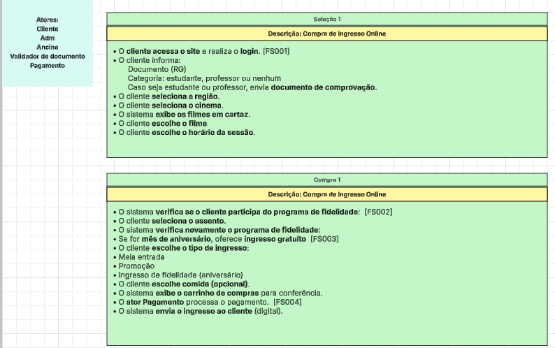
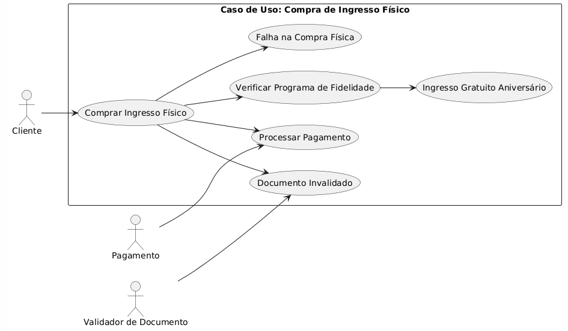
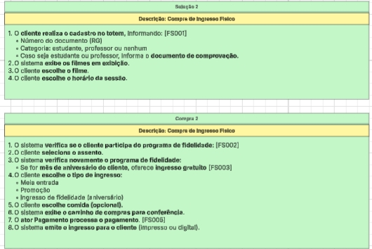
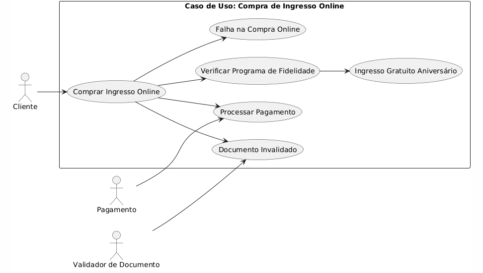
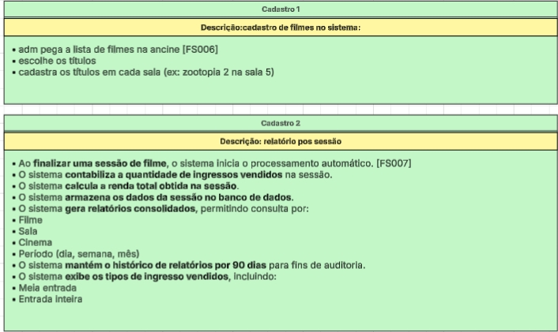
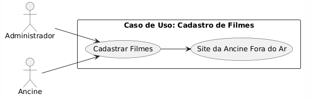
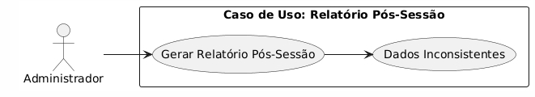
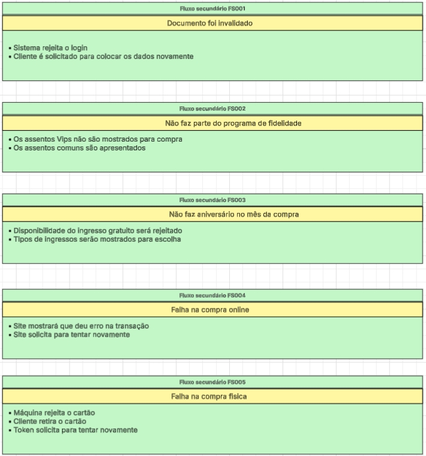
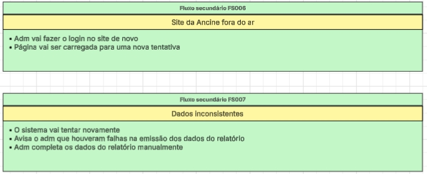

# Projeto-modelagem-de-softw
Modelagem de software orientado a objetos

Integrantes:

Nathan Vespasiano Fonseca

Felipe Da Rocha Pinheiro

Fernando Domingues

Este projeto apresenta a modelagem de um sistema de Cinema utilizando os conceitos de Orientação a Objetos. O objetivo é representar, de forma clara e organizada, as funcionalidades do sistema e as interações entre 
usuários e processos, como cadastro e compra de ingressos.

A seguir, serão apresentados os casos de uso e diagramas do nosso cinema junto com os nossos atores:

**Compra Fisica**

**Compra Online**

**Cadastro de filmes e Gerador de Relatórios**

**E então os fluxos secundarios caso aconteça imprevistos nos fluxos principais**

