# Projeto-modelagem-de-softw
Modelagem de software orientado a objetos

Integrantes:

**Nathan Vespasiano Fonseca**

**Felipe Da Rocha Pinheiro**

**Fernando Domingues**

Este projeto apresenta a modelagem de um sistema de Cinema utilizando os conceitos de Orientação a Objetos. O objetivo é representar, de forma clara e organizada, as funcionalidades do sistema e as interações entre 
usuários e processos, como cadastro e compra de ingressos.

A seguir, serão apresentados os casos de uso e diagramas do nosso cinema junto com os nossos atores:

**Casos De Uso**

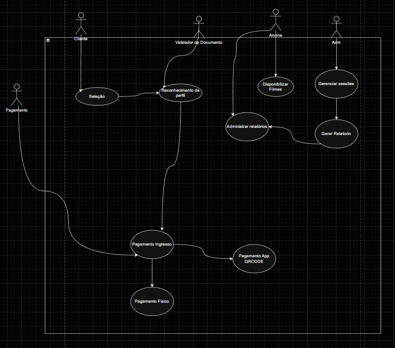

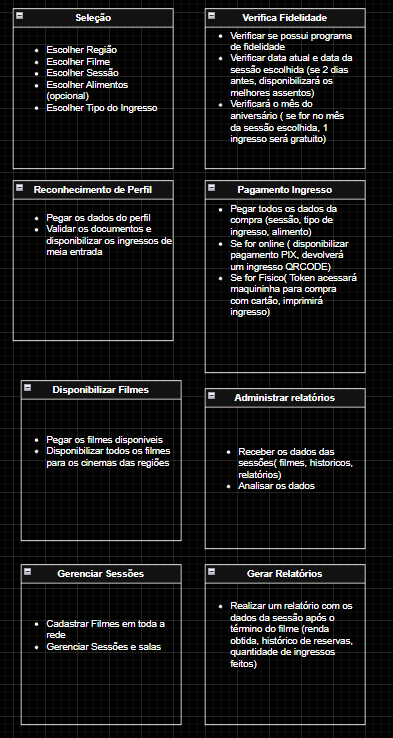

**Diagrama de Classes**

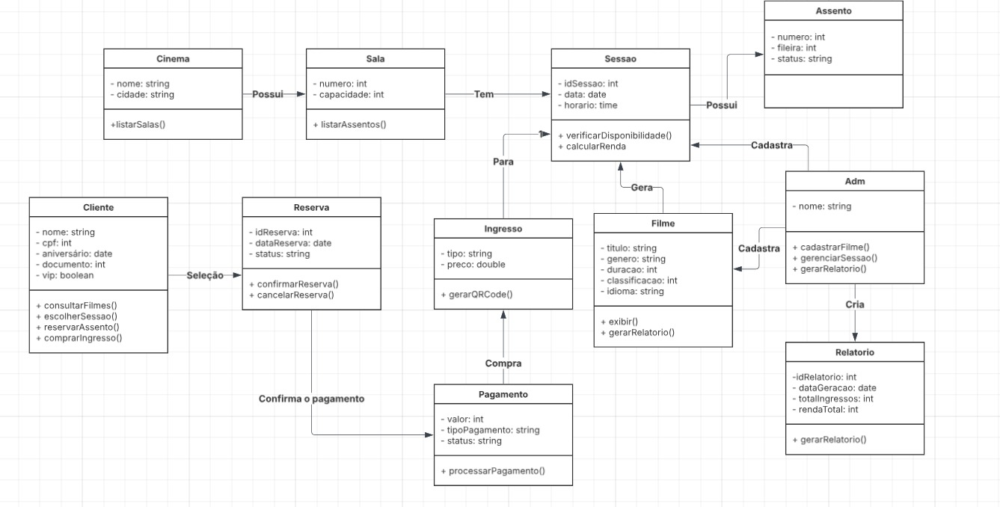

**Diagrama de Sequência**

* **Seleção - Verifica Fidelidade**
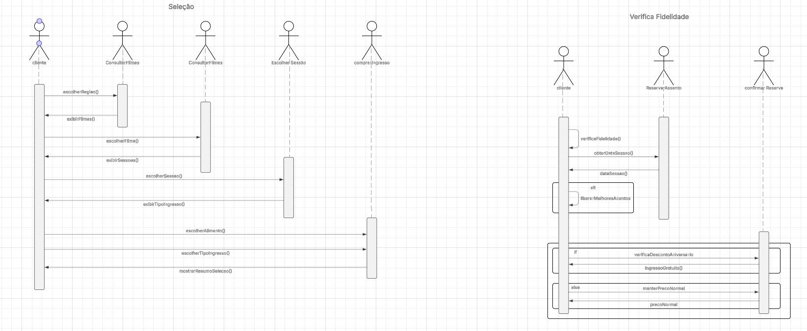

* **Reconhecimento de perfil - Pagamento Ingresso**

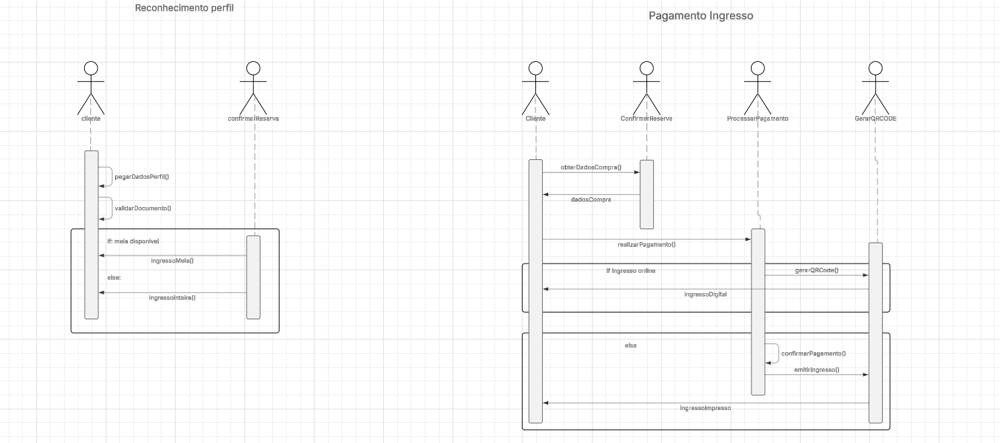

* **Disponibilizar Filmes - Administrar Relatórios**

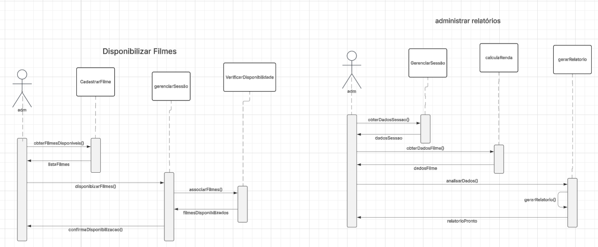

* **Gerenciar Sessões - Gerar Relatório**

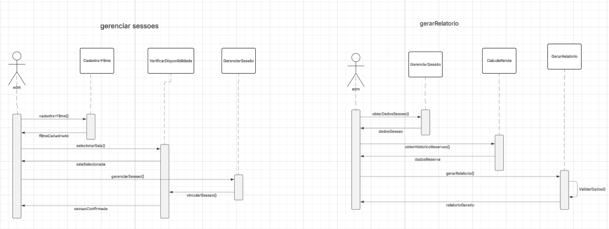

**Diagrama de Estados**

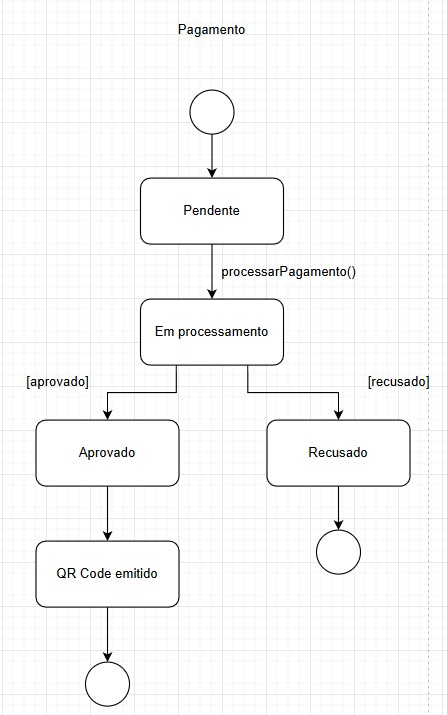

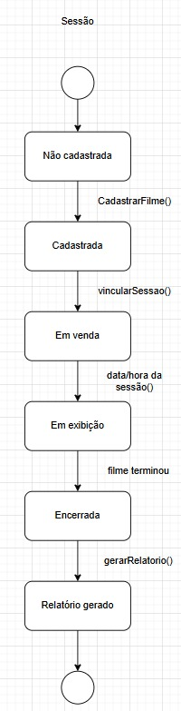

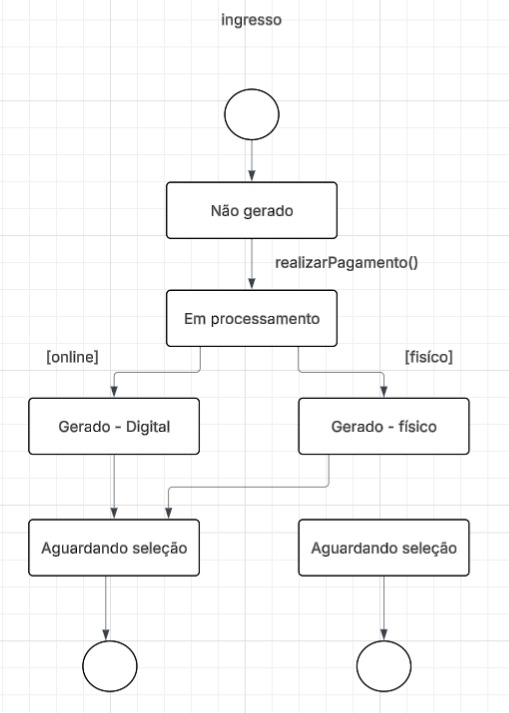

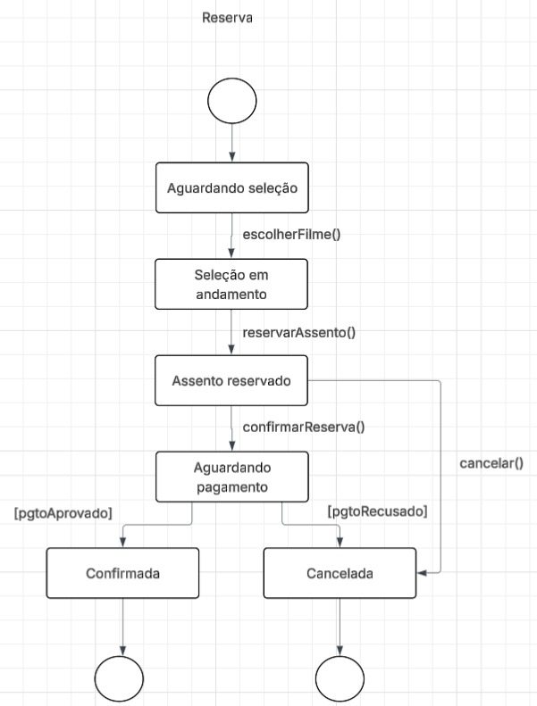

**Diagrama de Atividades**
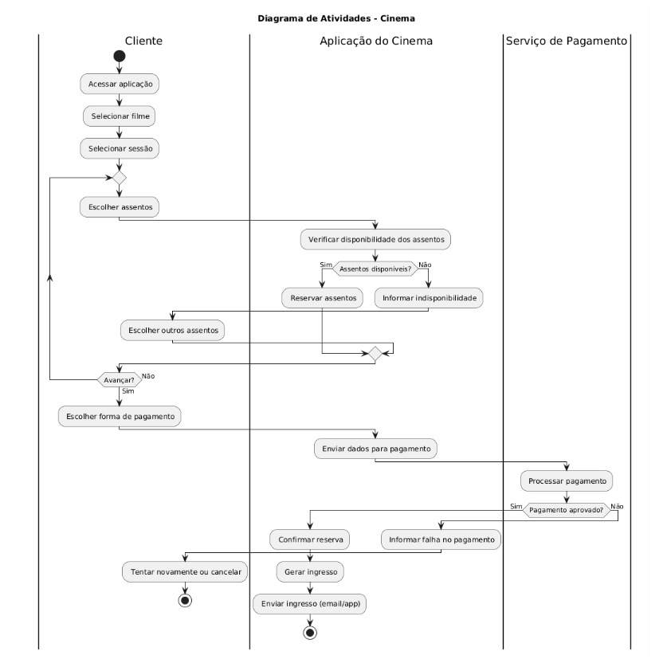
